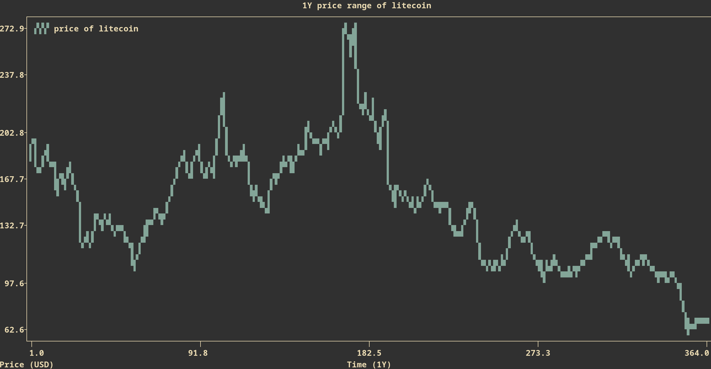

# cryptcli

## Description
The cryptcli is a python package that gives you access to cryptocurrency prices right in your terminal!
- API Used: [coincap](https://coincap.io/)
- Libraries Used: [typer](https://github.com/tiangolo/typer), [rich](https://github.com/Textualize/rich), [plotext](https://github.com/piccolomo/plotext), [inquirer](https://github.com/magmax/python-inquirer) 

## Installation
```zsh
$ pip install cryptcli
```

## Usuage
For a list of commands, type:
```zsh
$ crypt --help
```
To see specifics of each command, type:
```zsh
$ crypt [COMMAND] --help
```

## Commands
```zsh
$ crypt [COMMANDS] [ARGS]
  [COMMANDS] = info, list, hist, price
```

### hist
Arguments:
```zsh
$ crypt hist [cryptocurrentcy name (lowercase)]
```
This command will prompt you to select the interval, use the up and down arrow keys hitting enter to make a selection.
For example, type:
```zsh
$ crypt hist litecoin
```
After selecting a 1Y interval, you should see something like this!


### price
### hist
### info
